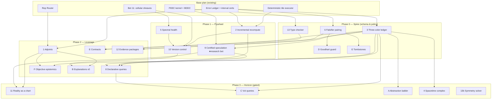

# COMPREHENSIVE ADDENDUM TO THE FRANKENSIM PLAN

## From Trustworthy Composition to an Epistemic Engine for Physical Claims

**Status:** Proposal for review. Amends and extends `COMPREHENSIVE_PLAN_FOR_FRANKENSIM.md`.
**Assumes:** The base plan's vocabulary and architecture — the Rep Router, the Error Ledger, Bet 11's cellular sheaves over the patch-adjacency complex, the FEEC-based physics kernel, BDDC/FETI-DP domain decomposition, interval-verified certificates, the Gauntlet, deterministic tile execution, and agent-swarm operation.
**Provenance:** This document is the consolidated output of an extended adversarial design review of the base plan. It contains nineteen proposals (numbered **1–13** and lettered **A–F**, preserving the IDs under which they were originally scored), a scoring system with full rationale, an implementation blueprint for each proposal, a sequenced roadmap, and a risk register. Every proposal ships with its own kill criterion, because a plan that cannot specify what would falsify it is not a plan.

## Ratified expansion deltas

The later new-domain expansion charter,
`COMPREHENSIVE_PLAN_TO_EXTEND_FRANKENSIM_TO_NEW_DOMAINS.md`, amends this
addendum only for the six named rows below. This register and the local notes in
the affected sections ratify those changes under Bead
`frankensim-ext-ratification-register-ozq0`.

| Delta | Sections amended in this addendum | Ratified rule |
|---|---|---|
| Coupling and passivity | Part 0; Proposal 13 | Only the Dirac interconnection is lossless by construction; components, discretization, transfer, iteration, sources/dissipation, and the closed accounting-window audit determine a coupled passivity claim (extension charter §3.7 and §6). |
| Contact ownership | Proposal 13 | Reusable detection/response protocols belong to L3 `fs-contact`; `fs-solid` and `fs-mbd` consume adapters, while generic conic/nonlinear algorithms stay in L1 `fs-solver` (extension charter §4.1 and §5.3). |
| Spectral ownership | Proposal 5 | Generic operator spectra, nullity, continuation health, and multiplier extraction belong to L1 `fs-spectral`; domain crates assemble and interpret operators (extension charter §3.2, §4.2, and §7.1). |
| Dimensional algebra | Proposal 9 | Amount of substance becomes the sixth base dimension atomically, with versioned five-to-six wire migration, immutable hash crosswalks, and semantic quantity kinds (extension charter §7.3). |
| Phase sequencing | Part IV.2 | The expansion charter's E0-E8 prerequisite DAG governs new-domain work, including the dry-tribology baseline before the E2 Geneva exit (extension charter §10). |
| Research governance | Part 0; Part II.3; Part IV.2-IV.3; Risk R10 | One unproven mechanism is allowed per independently falsifiable proof lane, with multiple lanes governed by an explicit portfolio WIP/budget cap (extension charter §2, D12). |

Document precedence must not resurrect three falsified readings: exact
incidence alone does not remove every spurious mode; IPC is not
unconditionally intersection-free; and a Dirac interconnection does not make
an arbitrary partitioned time discretization passive (extension charter §3.1,
§5.3, and §3.7). These exclusions are part of
`frankensim-ext-ratification-register-ozq0`, not optional commentary.

---

# Part 0 — Executive Summary

The base plan builds a system whose **composition is trustworthy**: multi-representation geometry glued by cellular sheaf cohomology, physics coupled through certified interfaces, and error bounds that survive every seam because they compose algebraically instead of dying at file-exchange boundaries. For power coupling, "trustworthy" means the Dirac interconnection is lossless and the full component/discretization/transfer/iteration/accounting-window obligations are audited; it does not mean arbitrary partitioned coupling is passive by topology alone. **Ratification note:** `frankensim-ext-ratification-register-ozq0`, extension charter §3.7 and §6. That property is real, rare, and architecturally unavailable to incumbents, whose seams are held together by human operators.

This addendum's thesis is that trustworthy composition is the *foundation*, not the product. Once composition is algebra, everything done **with** the composed object — optimizing it, re-solving variants of it, budgeting evidence about it, doubting it, merging concurrent edits to it, defending it to a regulator — inherits the algebraic structure. The nineteen proposals here systematically claim that inheritance. Their combined effect is an identity shift:

> **FrankenSim should not be a simulator that emits numbers. It should be an epistemic engine for physical claims — a system that maintains typed, priced, auditable beliefs about designs, where solvers, surrogates, symmetry arguments, and physical experiments are interchangeable evidence sources ranked by cost per unit of certainty, and where agents are the query load.**

Four proposals form a closed economic loop — the **flywheel** — and dominate the composite ranking:

1. **Certified speculation (Proposal 9):** untrusted fast models propose solutions; cheap certified checks accept or reject them; correctness never depends on the learned component, so aggression is free. Every certified run becomes training data, so the system gets faster with fleet usage.
2. **Tolerance-aware incremental recomputation (Proposal 2):** certified error bounds, run in reverse, prove which downstream results can absorb an upstream edit — memoization with a soundness certificate for every skip.
3. **Version control for physics (Proposal 10):** branch, diff, bisect, and merge for physical designs, with guarded sheaf incidence and gauge operators detecting unresolved merges; a separate executable closed/non-exact witness is required before any candidate receives a cohomology label.
4. **Compounding swarm memory (Proposal E):** assume-guarantee component contracts plus a tombstone ledger of falsified hypotheses, so a thousand agent instances accumulate rather than churn.

Speculation makes answers cheap; incremental recompute makes variants cheap; version control makes concurrency safe; swarm memory makes it all cumulative. Each accelerates the others. On top of the loop sits the interface the operator actually wants — **declarative queries against physics (Proposal 8)**: *"Is max von Mises stress under 180 MPa at 95% confidence, for under $50 of compute?"* — the imperative-to-declarative transition that databases made in the 1970s, available here for the same reason it was available then: a closed algebra over the operations.

Wrapped around the loop is an **epistemic type system** (Proposals 3, F, 6, D, 12) that prevents the failure mode certificates otherwise invite — being precisely wrong with a pedigree. Every quantity is colored *verified*, *validated*, or *estimated*; the objective function itself is subject to the same typing; every certificate ships with an independent falsifier; optimizer endpoints are distrusted by default; and results export as machine-checkable evidence packages a regulator can audit without trusting the vendor.

The sequencing philosophy, argued quantitatively in Part II and laid out in Part IV: **ship the practical spine immediately** (schema and policy work: 3, 6, D, E-tombstones, 13's type checker), **admit at most one unproven mechanism inside each independently falsifiable proof lane** (9 is the flywheel lane's mechanism, whose certified a-posteriori bounds unlock the speculation economy), and **let radical interfaces arrive as thin layers over proven machinery** (8 over 9's economics, B over 1's adjoints). Multiple proof lanes may proceed only under an explicit portfolio WIP/budget cap, with quarterly lane-specific kill criteria. **Ratification note:** `frankensim-ext-ratification-register-ozq0`, extension charter §2, D12.

---

# Part I — Derivation: Why These Nineteen

This addendum was not brainstormed; it was derived. The chain of analysis matters because it determines which proposals are load-bearing and which are optional, so it is recorded here in compressed form.

## I.1 The gluing problem is self-inflicted, and that is the point

Conventional simulation pipelines dissolve the consistency problem upstream: one privileged representation, one conforming mesh, consistency by construction. FrankenSim's Rep Router deliberately un-dissolves it — patches live simultaneously as SDFs, splines, and meshes, converted per-operation — because per-operation representation choice is where large accuracy-per-cost gains live. The cellular sheaf machinery of Bet 11 is the tax that choice imposes, paid in the cheapest currency available: on a finite patch-adjacency complex, cohomology is null spaces of sparse matrices. No deep theorem is load-bearing; the payoff is a type discipline for gluing whose interval errors localize to interfaces, whose deterministic gauge fits propose bounded repairs, and whose separately witnessed closed, non-exact skeleton cochains can justify cohomology labels without turning every numerical remainder into topology.

## I.2 The differentiation is composition, not physics

Unified multiphysics platforms already exist, and they teach a sobering lesson: unification at the solver level loses to specialized codes on every individual physics, and industrial users buy peak fidelity in the physics that dominates their problem. What no incumbent has — and cannot retrofit, because their architectures assume a human absorbs the seams — is **composition as a first-class certified operation**: error bounds, sensitivities, consistency statements, and provenance that survive every representation change, mesh transfer, and solver handoff. Every proposal in this addendum exploits compositional structure. None of them tries to win a single-physics fidelity race, because that race cannot be won by architecture.

## I.3 The operator is a swarm, and that changes what an error report must be

Traditional simulation's real consistency mechanism was the engineer who eyeballs the leaked mesh and fixes it. Agent-swarm operation removes that mechanism. Error objects must therefore localize themselves, classify their own fixability, and compose formally — and beyond errors, the *operator's* deficits must be designed for. An agent operator has no embodied physical intuition, no persistent cross-instance memory, poorly calibrated confidence, a documented tendency to game objectives, and a working memory that cannot hold a full design state. Proposals A–F each target one of those deficits directly, and Proposal D targets the most dangerous one: an agent optimizer is, in the limit, a maximally creative exploiter of model cracks, so the system must distrust its optima by default.

## I.4 The certificate culture has one fatal failure mode, and it must be typed away

A pipeline that is watertight to ε, cohomologically consistent, and interval-certified end-to-end can still compute the wrong answer with great precision — because RANS was the wrong closure, or the hazard model was a fiction, or the cost spreadsheet was folklore. In most industrial simulation, model-form error dominates discretization error by a wide margin, and it does not compose algebraically; it is beaten down by validation against experiment, one regime at a time. A certificate culture that is not explicit about this boundary manufactures false confidence. Hence the epistemic type system: three colors, composition rules that refuse to launder estimates into certificates, the objective function itself under the same discipline, and falsifiers as infrastructure.

## I.5 Design principles

Eight principles, distilled from the analysis above, govern every implementation decision in Part III:

**P1 — Buy correctness at the level of algebra.** Prefer formulations where the invariant holds identically (δ∘δ = 0, discrete de Rham exactness, type-checked couplings) over formulations where it is patched per-bug.

**P2 — Certificates must compose.** Any accuracy, sensitivity, or consistency statement that cannot be propagated through the ledger's DAG is a side channel, and side channels rot.

**P3 — Every certificate ships with its cheapest independent falsifier.** Certificates prove what the model claims; falsifiers probe whether the claims connect to reality. The gap between them is where simulation systems silently rot.

**P4 — Type the epistemics.** Verified, validated, and estimated are different kinds of knowledge with different composition rules. The type system must refuse to launder one into another.

**P5 — Design for the swarm's deficits.** No intuition → certified abstraction ladders and explanation objects. No memory → contracts and tombstones. Miscalibration → falsification budgets. Goodhart tendency → distrust optima by default.

**P6 — Exploit the check/produce asymmetry.** Verifying a candidate solution is vastly cheaper than producing one. This asymmetry is the economic engine of the whole system: speculation, cheap re-verification of evidence packages, and third-party audit all run on it.

**P7 — Concentrate research risk.** One research-grade bet at a time, chosen so its hard problem unlocks the most downstream value; everything else ships as engineering over known results.

**P8 — The plan itself must be falsifiable.** Every proposal carries a kill criterion with a measurement and a deadline. A proposal that survives only because nobody defined its failure condition is dead weight with good branding.

---

# Part II — The Scoring System

Nineteen proposals cannot all be first priorities, and a ranking without a stated method is decoration. This section records the metrics, the calibration rules, the full table, and — most importantly — what the table's structure implies about sequencing. The scores were produced under adversarial self-review; their known biases are declared in §II.4 rather than hidden.

## II.1 Metrics

Each proposal is scored 0–1000 on five axes:

| Metric | Question it answers |
|---|---|
| **Useful** | How much real design capability does this add for the end goal — exploring the world and producing optimal artifacts (aircraft, seismic structures) at lowest cost? |
| **Innov** | How far is this from anything that exists in commercial or research systems? (Distance, not difficulty.) |
| **Pract** | How feasible is this now, with known methods? Inverse of research risk. A 900 is policy/engineering over existing machinery; a 450 contains an open research problem. |
| **Accret** | Does value compound with use? Does it deepen a moat — data flywheels, network effects, switching costs, standards capture? |
| **Agent** | How much leverage does this create specifically when the operator is an agent swarm rather than a human engineer? |

Two aggregates:

- **Mean** — unweighted average of the five. Used as the composite ranking.
- **Ex-A** — mean of the first four, excluding Agent. This column exists as a falsifier for a specific bias, explained in §II.4.

**Calibration rules.** The original thirteen proposals (1–13) were scored first and then frozen as anchors; proposals A–F were scored against those anchors. The hundreds digit is signal; the tens digit is texture. A 260-point spread is a defended claim; a 10-point spread is noise, and ties are broken on the Agent column (Mean order) or the Ex-A column where stated.

## II.2 The Combined Table

Sorted by composite Mean. IDs are stable and used throughout Part III.

| # | Proposal | Useful | Innov | Pract | Accret | Agent | **Mean** | Ex-A |
|---|---|---|---|---|---|---|---|---|
| 9 | Certified speculation | 950 | 850 | 600 | 950 | 900 | **850** | 838 |
| 2 | Incremental recomputation | 900 | 800 | 750 | 850 | 900 | **840** | 825 |
| 10 | Version control for physics | 850 | 850 | 700 | 750 | 950 | **820** | 788 |
| 8 | Declarative physics queries | 900 | 900 | 450 | 800 | 1000 | **810** | 763 |
| E | Contracts + tombstones | 850 | 700 | 600 | 950 | 950 | **810** | 775 |
| 3 | Three-color ledger | 850 | 750 | 800 | 800 | 850 | **810** | 800 |
| 6 | Falsifier pairing | 800 | 650 | 900 | 700 | 900 | **790** | 763 |
| F | Objective epistemics | 900 | 700 | 750 | 750 | 850 | **790** | 775 |
| A | Certified abstraction ladder | 900 | 750 | 500 | 800 | 950 | **780** | 738 |
| C | Value-of-information queries | 850 | 800 | 500 | 800 | 950 | **780** | 738 |
| 1 | End-to-end adjoints | 950 | 700 | 550 | 700 | 950 | **770** | 725 |
| B | Explanation objects | 800 | 800 | 550 | 750 | 950 | **770** | 725 |
| D | Goodhart guard | 850 | 650 | 850 | 600 | 900 | **770** | 738 |
| 11 | Reality as a chart | 900 | 750 | 500 | 850 | 800 | **760** | 750 |
| 13 | Interface types + symmetry | 750 | 650 | 800 | 550 | 850 | **720** | 688 |
| 12 | Evidence packages | 800 | 700 | 700 | 900 | 500 | **720** | 775 |
| 5 | Spectral health monitoring | 650 | 600 | 850 | 500 | 700 | **660** | 650 |
| 7 | Wedge + plugin surface | 750 | 400 | 900 | 850 | 300 | **640** | 725 |
| 4 | Spacetime complex | 600 | 700 | 600 | 500 | 550 | **590** | 600 |

**Composite order:** 9 › 2 › 10 › 8 › E › 3 › 6 › F › A › C › 1 › B › D › 11 › 13 › 12 › 5 › 7 › 4.
**Ex-A order (business/investor lens):** 9 › 2 › 3 › 10 › E ≈ F ≈ 12 › 8 ≈ 6 › 11 › A ≈ C ≈ D › 1 ≈ B ≈ 7 › 13 › 5 › 4.

## II.3 What the Table's Structure Implies

**Finding 1 — The top four form a closed loop; that is why they are the top four.** Speculation (9) makes queries cheap; cheap queries make the incremental cache (2) hot; the cache and the certified corpus feed the query planner (8) real cost data; version control (10) makes the corpus safe for a swarm to generate concurrently; swarm memory (E) makes the whole thing cumulative. Each accelerates the others. This loop is the flywheel, and it is also the artificial sensorimotor system that substitutes for the embodied intuition an agent operator lacks.

**Finding 2 — Practicality and innovation anti-correlate across the set**, which dictates a portfolio structure rather than a priority list. Proposals 8, 9, 11, A, C are high-innovation/lower-practicality (each contains an open problem); proposals 5, 6, 7, D, 13 are the reverse. The correct move is not to execute the ranking top-down but to ship the practical spine immediately, isolate one unproven mechanism per falsifiable proof lane, cap the portfolio's aggregate WIP/budget, and let radical interfaces arrive as layers over proven machinery. **Ratification note:** `frankensim-ext-ratification-register-ozq0`, extension charter §2, D12.

**Finding 3 — The lens changes the ranking, and both lenses are right about different things.** Through the operator-agent lens, 8 earns the table's only 1000 (it is the agent's native interface: questions and budgets, not meshes and timesteps) while 7 and 12 score 300–500. Through the Ex-A business lens, 12 rises to effectively 6th and 7 into the 725 band, because regulatory capture and ecosystem moats are how the *company* wins even though they change nothing about a Tuesday-night design session. The synthesis is a slogan with operational content: **build in composite order, sell in Ex-A order.**

**Finding 4 — A–F are second-story construction, and their Pract scores say so.** B rides on 1's adjoints, D on 6's falsifier registry, F on 3's schema, C on 3's uncertainty accounting, A on the ledger itself. Five of the six operator-lens proposals are consumers of infrastructure the original thirteen build. That is sequencing discovered by scoring, not a weakness. The cheap immediate wins hidden in the new set are D (850 Pract — pure policy over existing machinery) and the tombstone half of E.

## II.4 Declared Biases and Epistemic Status of the Scores

Two confessions, because a scoring system that audits everything except itself is a joke at its own expense.

**The circularity confession.** Proposals A–F were *generated by optimizing the agent-operator lens*, so their Agent scores of 850–950 are partially circular — Goodhart in miniature, inside the scoring table, exactly the failure mode Proposal D exists to catch. The Ex-A column is the falsifier: strip the lens and A, B, C, D drop to the 725–740 band — solid middle-pack, not top-tier. Their value is **conditional on the swarm actually being the operator**. If FrankenSim ships with humans driving, they are deferrable; if agents drive, the Agent column is the real economy and the composite order stands.

**The robustness check that passed.** Proposals 9, 2, and 10 top both the composite and the lens-off ranking. The headline ordering is robust to the very bias confessed above, which is the closest a self-scored table gets to validation.

**Standing instruction.** These scores are a confident-looking artifact produced by a confabulation-prone mechanism. Treat the hundreds digit as signal, the tens as texture, and subject this table — like every optimum the system will ever produce — to independent adversarial review before load-bearing decisions rest on it. The fact that adding one column moved four ideas by ten ranks is a direct measurement of how much load the table can bear.

---

# Part III — The Proposals

The nineteen proposals are organized into five architectural layers rather than by the order they were conceived, because the layers are how they should be built. Each proposal follows the same schema: **Claim** (one sentence), **Rationale**, **Implementation blueprint** (the optimal path as currently understood, including data structures, algorithms, and the specific known results to build on), **Dependencies**, **Amendments to the base plan**, and **Kill criterion** (P8: the measurable condition under which the proposal is descoped, with its fallback).

---

## Layer 1 — The Economic Engine (The Flywheel)

*Proposals 9, 2, 10, E, 8. The closed loop that makes every downstream query cheaper, every variant cheaper, every concurrent edit safe, and every result cumulative — then puts the right interface on top.*

---

### Proposal 9 — Certified Speculation *(Useful 950 · Innov 850 · Pract 600 · Accret 950 · Agent 900 · Mean 850)*

**Claim.** Let untrusted fast models propose solutions and cheap certified checks dispose of them, so that correctness never depends on the learned component and aggression is therefore free — then harvest every certified run as training data, creating a system that gets faster with fleet usage.

**Rationale.** The deep asymmetry of numerical computing is that *checking* a candidate solution (one residual evaluation, roughly linear in problem size) is vastly cheaper than *producing* one (a superlinear solve). This is the same asymmetry that makes speculative decoding work in LLMs, and it transplants directly. Because the verifier is certified, proposers can be maximally aggressive: fp8 tensor-core surrogates, coarse-rung prolongations, first-order extrapolations from neighboring designs — none of them trusted, all of them useful. The accretion score of 950 reflects the flywheel: accept rates climb with fleet usage, a network effect no per-seat simulation license has ever had.

**Implementation blueprint.**

*Proposer zoo (all untrusted, all hot-swappable behind one interface `propose(state, query) → candidate, self_reported_confidence`):*
1. **Neighbor extrapolation** — retrieve the nearest certified run in design space via the content-addressed store's provenance graph; apply a first-order Taylor correction using the cached adjoint (Proposal 1) when available. Cheapest proposer, likely the workhorse for design-iteration workloads.
2. **Coarse-rung prolongation** — solve on fidelity rung *k−1* (Proposal 3's ladder), prolongate to rung *k*. Classical, reliable, embarrassingly parallel with the target solve's setup phase.
3. **Neural surrogates** — graph networks over the tile/patch complex (the natural architecture given the base plan's tile executor), trained on the ledger corpus, executed in low precision on tensor cores.

*Verifier (the load-bearing component, and the one hard analysis problem — concentrated per P7):*
- **Elliptic and FEEC-structured problems:** equilibrated-flux a-posteriori estimators (Prager–Synge; Braess–Schöberl; Ern–Vohralík) give **guaranteed, constant-free upper bounds** on the energy-norm error via an H(div)-conforming flux reconstruction. This is the decisive fact: the base plan's FEEC kernel already provides the H(div) machinery, so for a large and commercially central class of problems the "hard analysis" is purchasable from the literature rather than invented. Evaluate the reconstruction in interval arithmetic and the bound is a *verified*-color certificate.
- **Goal-oriented refinement of the accept test:** dual-weighted-residual (DWR) estimates for the query's actual QoI. DWR constants are not guaranteed, so DWR-based accepts carry *estimated* color unless bracketed by an equilibrated bound — the three-color system (Proposal 3) is what makes this mixture safe to use.
- **Nonlinear/transient problems:** interval-verified residual norms plus continuation — the candidate is accepted only as a warm start, never as an answer, and the measured value is iteration savings.

*Accept/reject economics:* accept outright if the certified bound meets the query tolerance; otherwise warm-start the true solver (Krylov initial guess; nonlinear continuation from the candidate) and log iterations saved. Track per-proposer, per-regime accept rates and speedups in the ledger — this telemetry is simultaneously the surrogate training signal, the query planner's cost model (Proposal 8), and the drift detector (an accept-rate collapse in a regime is a distribution-shift alarm that automatically demotes the proposer there).

*Precision discipline:* speculate low (fp16/fp8), verify high (interval or fixed high precision), in the mixed-precision iterative-refinement pattern. The verifier's precision is what the certificate inherits; the proposer's precision is nobody's business.

*The knowledge apex — dimensional mining:* with a units-typed schema on all ledger quantities, run automated Buckingham-π extraction plus symbolic regression over the certified corpus to conjecture closed-form scaling laws. The dimensional substrate is `[m,kg,s,K,A,mol]`; five-vector legacy records decode only through a versioned semantic-crosswalk receipt that preserves old bytes/hashes and records `old_hash→new_hash`. Semantic quantity kinds remain distinct even when dimensions agree. **Ratification note:** `frankensim-ext-ratification-register-ozq0`, extension charter §7.3. Conjectures enter the ledger as *estimated*-color with a validity envelope equal to the convex hull of supporting data in π-space, and are promoted only by surviving the falsification budget (Proposal 6). The system does not merely answer design questions; it accumulates engineering knowledge with pedigrees.

**Dependencies.** Ledger telemetry schema (3); falsification budget (6) for promotion of mined laws; adjoint cache (1) upgrades proposer #1 but is not required for v0.

**Amendments to base plan.** The Gauntlet gains a standing benchmark: proposer accept-rate and end-to-end speedup per physics kernel per regime. The Error Ledger schema gains `(proposer_id, accepted, bound, iterations_saved)` fields on solve nodes.

**Kill criterion.** If, six months after the first two physics kernels ship with equilibrated estimators, accept rates at customer-realistic tolerances cannot exceed ~30% *and* median warm-start savings are below 1.5×, the speculation economy does not close. Fallback: keep the estimators (they are needed for adaptivity regardless) and the warm-start path; retire the proposer zoo and the fleet-learning claim.

---

### Proposal 2 — Tolerance-Aware Incremental Recomputation *(900 · 800 · 750 · 850 · 900 · Mean 840)*

**Claim.** Content-address every artifact, make the ledger's dependency graph the build graph, and — the part no build system has — use the composed error bounds to *prove* which downstream results can absorb an upstream perturbation within their existing tolerance, skipping their recomputation with a certificate for why skipping is sound.

**Rationale.** Agent-driven design exploration is thousands of nearby variants. Bit-level invalidation (Nix/Bazel semantics) says "something changed, rerun everything downstream." Tolerance-level invalidation says "this change provably does not matter past stage four." That is the difference between a thousand full re-simulations and a thousand cheap delta-solves, and the semantics only exists because error bounds compose — it is the Error Ledger run in reverse. This is the economic engine of agentic workloads and deserves headline-bet status, not plumbing status.

**Implementation blueprint.**

*Store:* a Merkle DAG where each node records `(op_id, input_hashes, params, code_version_hash, rng_seed, achieved_error, required_tolerance)`. The gap `required_tolerance − achieved_error` is the node's **slack**, and slack is the resource this whole proposal spends. Deterministic execution is a hard prerequisite: fixed reduction orders, no unordered atomics — the base plan's deterministic tile executor is the enabling asset and must be treated as load-bearing infrastructure, not a nicety.

*Invalidation algorithm:* each ledger edge carries a certified local sensitivity bound `L_op` (obtained by interval evaluation of the op's derivative over the perturbation box, or from cached adjoint magnitudes where Proposal 1 is live). A perturbation `δ` at a node propagates forward as a certified interval `‖Δoutput‖ ≤ Π L_op · ‖δ‖` along each path, combined by the ledger's existing composition rules. A downstream node is **reused** iff its accumulated incoming bound fits inside its recorded slack; the reuse decision is itself written to the ledger as a *verified*-color claim ("skipped: perturbation absorbed, bound X ≤ slack Y"). Otherwise the node joins the recompute frontier.

*API:* `plan = ledger.perturb(node, δ)` returns the minimal recompute frontier, its estimated cost (feeding Proposal 8's planner), and the certificate for everything skipped.

*Cache policy:* cost-weighted eviction (recompute-cost × hit-probability, both measurable from telemetry); pinning for anything referenced by an evidence package (Proposal 12) or a contract (Proposal E).

*Graceful degradation:* when sensitivity bounds are too loose (nonlinear ops with pessimistic interval derivatives), the frontier balloons toward the full DAG and the system silently degrades to ordinary hash-based memoization — still correct, just less clever. Track **skip yield** (fraction of DAG certifiably skipped on realistic edit traces) as the health metric that tells you which ops need tighter local bounds.

**Dependencies.** Deterministic execution (base plan); ledger composition rules (base plan); stable content addressing. Adjoints (1) sharpen the sensitivity bounds but interval derivatives suffice for v0.

**Amendments to base plan.** Determinism is promoted from implementation detail to certified contract with its own Gauntlet tests (bitwise reproducibility across runs and worker counts). Ledger nodes gain `slack` as a first-class field.

**Kill criterion.** If skip yield on recorded agent design-iteration traces delivers < 2× median wall-clock speedup versus plain hash memoization after the first vertical is live, freeze the certified-skip layer (keep plain memoization, which pays for itself regardless) and revisit only when adjoint-sharpened bounds exist.

---

### Proposal 10 — Version Control for Physics *(850 · 850 · 700 · 750 · 950 · Mean 820)*

**Claim.** Give physical designs the full verb set of modern version control — branch, diff, bisect, merge — where *diff* is semantic ("where do the fields differ beyond tolerance, and which upstream edit caused it"), *bisect* is exact (deterministic replay), and *merge* reuses sheaf operators under a fail-closed policy: deterministic gauge reconciliation is accepted only after a nominal post-state residual check, while unresolved candidate remainders retain their interface support and provenance. Only a separately retained closed, non-exact cochain witness may be promoted to an H¹ obstruction in its validated skeleton complex.

**Rationale.** Swarm-scale concurrent engineering is gated on exactly one thing: whether concurrent edits can be reconciled safely. PLM systems version files; nothing versions physics. The sheaf machinery built for watertightness supplies valuable incidence and gauge operators, but its interval seam verdict and the feature-gated merge heuristic have different proof obligations. Reusing those operators with explicit post-state checks and no-claim boundaries remains the single most elegant opportunity in this addendum, and the capability has no analogue anywhere.

**Implementation blueprint.**

*Commits and branches:* a commit is the Merkle root of the design-plus-ledger state; branches are pointers; checkout of a nearby branch is cheap because Proposal 2 makes the delta-solve cheap. This is free-riding on infrastructure already justified.

*Semantic diff:* requires **stable entity identity** in the geometry kernel — patches, interfaces, and load cases must carry persistent IDs across edits. This is a genuine, non-negotiable constraint on the kernel design (topological naming is a famously hard CAD problem; the mitigation is that FrankenSim controls its own kernel and can make IDs first-class from day one rather than reconstructing them heuristically). Given stable IDs: align the two patch complexes, compute field differences beyond tolerance on shared support, then attribute each significant difference by walking the provenance DAG back to the first divergent op. The diff report is an object: `(region, quantity, magnitude, causal_edit)` — reviewable by an agent or a human.

*Bisect:* deterministic replay plus a monotone predicate ("QoI within spec") gives standard binary search over the commit sequence. Run the inner loop at a low fidelity rung or on a surrogate (colored *estimated*), confirm the culprit commit at full fidelity (colored *verified*). Git-bisect for a wrong number.

*Merge — the crown jewel:* three-way merge with base B and branches X, Y. Form the naive union of edits as an interface cochain and run the deterministic fixed-iteration gauge reconciliation. Apply that candidate reconciliation automatically only when the nominal post-state residual passes the requested tolerance, and attach the residual receipt. If the check fails, retain any dominant decomposition remainder as a candidate conflict localized to its supporting interface cells with both parents' provenance, then escalate; this generic path makes no H¹, non-exactness, or no-local-fix claim. A promotion to an H¹ obstruction additionally requires a validated compatible complex plus executable closure and non-exactness evidence. Conflicts above the geometric level (both branches edited the same load case or material assignment) are caught by the typed-interface layer (Proposal 13) as type-level conflicts.

**Dependencies.** Proposal 2 (cheap branches); Bet 11's sheaf operators (merge); Proposal 5 (the candidate-remainder/gauge-fit split's trustworthiness is conditioned on the spectral gap — a merge performed in a degraded-gap region must be flagged low-confidence); Proposal 13 (non-geometric conflict typing).

**Amendments to base plan.** The geometry kernel spec gains stable persistent entity IDs as a hard requirement. Bet 11 gains the merge semantics as a named deliverable.

**Kill criterion.** Run swarm concurrency trials early. If more than ~25% of realistic merges retain candidate-remainder conflicts or otherwise fail the post-state residual check, agents are operationally colliding and merge-based concurrency is the wrong model — fall back to ownership partitioning (region locks) with merge reserved for lock boundaries, and record that the guarded sheaf-operator path still earned its keep as a fail-closed conflict *detector*. The seeded candidate-remainder-rate helper is only one diagnostic numerator; it cannot discharge this gate without retained escalation, refusal, and type-conflict counts from the same trials.

---

### Proposal E — Compounding Swarm Memory: Contracts and Tombstones *(850 · 700 · 600 · 950 · 950 · Mean 810)*

**Claim.** Give the swarm two memory structures so that a thousand instances accumulate instead of churn: **assume-guarantee component contracts** (certified design motifs whose certificates compose into system certificates) and a **tombstone ledger** of falsified hypotheses (so failed explorations are indexed, retrievable, and never silently re-run).

**Rationale.** Agent instances are many and memoryless; the naive swarm burns its budget re-dying the same deaths. Humans do not publish negative results because incentives are broken; a swarm has no such excuse — its negative results are just rows it declined to write. The 950 accretion score is the point: this is the substrate on which everything else compounds.

**Implementation blueprint.**

*Tombstones (ship in weeks — this is the cheap half):* a tombstone records `(hypothesis/design-region descriptor, evidence against, certificates and their colors, compute spent, date, authoring context)`. Indexed two ways: embedding similarity over the descriptor, and — the domain-native index — signature in dimensionless-group space (π-coordinates from Proposal 9's units-typed schema), because "aluminum bracket at Re 2×10⁵" and "steel bracket at Re 2.1×10⁵" should collide as the *same death* even though their raw parameters differ. Agent protocol, enforced at the orchestrator: before funding an exploration, query the tombstone index; on a hit, the agent must either cite a distinguishing feature (which is itself logged, so distinguishing features accumulate too) or skip. Tombstones are appended automatically whenever a falsification-budget test (Proposal 6) kills a claim or an optimization branch is abandoned above a cost threshold.

*Contracts (the ambitious half):* a contract is `(environment envelope ⇒ guaranteed behavior, certificate)`, with the envelope expressed over typed interface quantities (Proposal 13) as interval boxes — e.g., "for traction loads within this box on this interface type, max stress ≤ σ* with a rung-2 verified certificate." Composition rule v1 is deliberately primitive: **envelope containment** — component contracts compose into a system claim iff each component's operating conditions, as computed by the system model, provably land inside its envelope (an interval containment check, hence cheap and *verified*-color). Start where superposition makes envelopes tractable (linear regimes); nonlinear contracts carry validity-region tags and remain *estimated*-color until validated per regime (Proposal 3's rules apply — contracts are not exempt from the type system). A contract library becomes the swarm's vocabulary of certified motifs: "this stiffener topology dominates in this load regime, envelope attached," reusable by instance N+1 without re-derivation.

**Dependencies.** Tombstones: none beyond the ledger and Proposal 6's kill events. Contracts: Proposal 13 (typed interfaces), Proposal 3 (colors), and honestly-scoped envelopes.

**Amendments to base plan.** The agent orchestration layer gains the mandatory tombstone-check step. The Gauntlet gains contract-composition soundness tests (a composed system claim must never be tighter than its weakest member's certificate permits).

**Kill criterion.** *Tombstones:* if after one quarter of swarm operation the measured re-exploration rate (fraction of funded explorations landing within an existing tombstone's neighborhood without a cited distinguisher) does not fall materially, the indexing is wrong — fix retrieval before adding features. *Contracts:* if envelope containment is almost never satisfiable on real assemblies (envelopes too conservative to compose), demote contracts to documentation-plus-full-reverification and revisit when per-regime validation data (3/F) can justify tighter envelopes.

---

### Proposal 8 — Declarative Queries Against Physics *(900 · 900 · 450 · 800 · 1000 · Mean 810)*

**Claim.** Kill the "run a simulation" interface. The operator poses a question with a confidence requirement and a budget — *"is max von Mises stress under 180 MPa at 95% confidence, answer for under $50?"* — and the system plans the cheapest computation that discharges the query, because the ledger lets it cost and certify candidate plans before running them.

**Rationale.** Every incumbent interface is imperative: the user specifies mesh, solver, and timestep, and receives whatever accuracy falls out. The imperative-to-declarative inversion is available here for exactly the reason it was available to relational databases: a closed algebra over the operations, with costs. ANSYS cannot cost-optimize its own pipeline because it has no composable model of its own error. The 1000 Agent score is unique in the table: agents should not drive solvers; they should ask questions and spend budgets. This is the correct agent API, full stop. The 450 Pract score is equally honest: the general planner is a research program.

**Implementation blueprint (severely and deliberately scoped).**

*Query language v0:* `(QoI expression over typed fields, tolerance or confidence target, budget, deadline)`. QoIs are declared functionals with metadata flags: linearity, adjoint availability, fidelity-ladder applicability. No general programs — a menu of functional forms that covers the wedge vertical's real questions (max-over-region, integral, exceedance probability under a declared environment distribution per Proposal F).

*Planner v0 — a ladder walk, not a general planner:* the search space is deliberately collapsed to the **fidelity-refinement lattice**: choose a rung (surrogate / rung-1 / rung-2 …), then refine spatially where DWR indicators say the QoI error concentrates, then either climb a rung or stop. The planner is a greedy loop over the operator menu `{cache lookup (2), speculate (9), solve at rung k, DWR-refine, climb}` using cost estimates learned from ledger telemetry. This is a near-one-dimensional control problem with a learned cost table — tractable now — and it inherits all its intelligence from the flywheel underneath it rather than from planning research.

*Anytime semantics (the operator-facing contract):* every query returns immediately with a wide certified interval and tightens as budget is spent; the caller — agent or human — decides when the answer is good enough. Each returned interval carries a "what would tighten this" hint (the top entry from Proposal C's value-of-information ranking), so the interface teaches its own users where their money goes.

*Refusal semantics:* when the budget cannot discharge the query at the requested confidence, the system says so *with the certified interval it did achieve* and the price of the gap — never a silent best-effort number dressed as an answer.

**Dependencies.** Hard: 9 (speculation supplies the cheap rungs and the cost telemetry), 2 (cache), 3 (colors on the returned interval), 6 (DWR-based accepts need falsifier coverage). Soft: C, F.

**Amendments to base plan.** The public API is re-specified around queries; imperative solver access is demoted to an internal/expert surface.

**Kill criterion.** If the greedy planner cannot beat a fixed sensible baseline (single mid-rung solve + uniform refinement) by ≥ 2× cost at equal certified accuracy on the wedge vertical's benchmark query set, **ship the query interface anyway** (anytime semantics + refusal semantics are product wins independent of planning cleverness) and freeze planner research — revisit only when fleet telemetry is rich enough to make the cost table sharp.

---

## Layer 2 — The Epistemic Type System

*Proposals 3, F, 6, D, 12. The discipline that prevents the certificate culture's one fatal failure mode — being precisely wrong with a pedigree — and then turns that discipline into the product regulators buy.*

---

### Proposal 3 — The Three-Color Ledger *(850 · 750 · 800 · 800 · 850 · Mean 810)*

**Claim.** Stop pretending one epistemic type suffices. Every quantity in the ledger carries a color — **verified** (interval-certified numerics), **validated** (anchored to experimental data in a stated regime), or **estimated** (cross-model discrepancy probes and surrogates) — with composition rules enforced by the type system, so an estimate can never be laundered into a certificate.

**Rationale.** A pipeline that is watertight to ε and interval-certified end-to-end can still be computing the wrong answer with great precision, because model-form error (wrong turbulence closure, wrong material law) dominates discretization error in most industrial practice and does not compose algebraically. A system that *knows and displays* the boundary between its numerical certainty and its modeling uncertainty would be unique in the industry — and it defuses "precisely wrong with a pedigree" before a customer discovers it for you.

**Implementation blueprint.**

*Schema:* `color ∈ {verified, validated, estimated}` on every ledger node, plus color-specific payloads — verified: the interval bound; validated: a **regime tag** (a region in a declared feature space: Reynolds range, strain range, temperature range…) and the anchoring dataset's identity; estimated: the estimator's identity and its own dispersion.

*Composition rules, type-checked at ledger-write time:*
- verified ⊕ verified → verified (bounds compose by the existing ledger algebra);
- validated ⊕ X → validated only while execution stays inside the regime tag; the moment a computed state exits the declared regime, **automatic demotion to estimated** plus a flag — validation is a regional property and the type system enforces the region;
- anything ⊕ estimated → estimated. No exceptions, no overrides without a signed waiver that itself appears in the provenance.

*Making the third color computable — discrepancy probes:* maintain every physics kernel as a rung on an explicit **fidelity ladder** (e.g., potential/Euler → RANS → LES; linear elastic → hyperelastic → plasticity). Agents run automated probes — the same design point evaluated on adjacent rungs, on automatically selected subdomains — and the discrepancy fields are stored as measured, localized model-form estimates. Humans never do this systematically because it is tedious; a swarm does it overnight. Probe scheduling is by expected information (Proposal C) under a capped fleet-budget fraction.

*Reporting:* every result's headline carries its color; every report ends with a **budget pie** — where the error budget is actually being spent, by color — so "refine the mesh" is never prescribed when the budget says "your closure is the problem."

**Dependencies.** None hard — this is schema and policy, hence Pract 800. Fidelity ladders per kernel are the ongoing cost.

**Amendments to base plan.** The Error Ledger specification is extended from one error type to three colors with the rules above; the Gauntlet gains laundering tests (adversarial pipelines that attempt to upgrade estimated to verified must fail the type check).

**Kill criterion.** Not applicable in the usual sense — this is load-bearing schema. The controllable risk is probe compute; cap discrepancy probing at a fixed percentage of fleet budget and audit quarterly whether probe-derived model-form maps actually changed downstream decisions (if they never do, the probe scheduler — not the color system — is what gets fixed).

---

### Proposal F — Objective Epistemics: Three Colors for the Goal Itself *(900 · 700 · 750 · 750 · 850 · Mean 790)*

**Claim.** Loads, missions, hazards, and cost models enter the ledger as typed evidence with their own colors and validation anchors — because in "cheapest earthquake-resistant building," the structural mechanics is the easy, well-posed half, and what actually determines the answer is the ground-motion ensemble, the cost spreadsheet, and the loss function.

**Rationale.** If the objective's ingredients live outside the system as fixed inputs, the optimizer will optimize a fiction with certified precision — the exact failure mode Proposal 3 fixes for physics, relocated to the objective, where it is worse because nobody is watching. An optimum that is robust across the hazard posterior is a different, and honest, artifact from an optimum against one design spectrum.

**Implementation blueprint.**

*Environments as first-class artifacts:* a hazard/mission model is a distribution object with a color and anchors — for the seismic example, a site-specific probabilistic seismic hazard posterior (validated, with the underlying catalog cited), or at minimum a code design spectrum explicitly tagged *"validated: code-conformance only,"* which is an honest and legally meaningful color. Cost models are itemized, versioned, provenance-carrying artifacts, not spreadsheet folklore.

*Optimization API:* objectives must be declared as functionals over `(design, environment random variable)`. The default deliverable is a **robust optimum** — CVaR or distributionally-robust over the declared ambiguity set — plus the sensitivity of the optimum to perturbations of the hazard model itself, computed by adjoints (Proposal 1) through a sample-average approximation with common random numbers, which Proposal 2's cache makes affordable (the same sample paths re-solved as deltas across design variants).

*Reporting rule:* the headline number's color is the color of its **weakest input**. A verified structural solve under an estimated hazard is an estimated answer, and the report says so. For the seismic vertical specifically, the deliverable is a **fragility curve with colored confidence bands**, not a binary "safe."

**Dependencies.** 3 (colors), 1 (hazard-sensitivity adjoints), 2 (affordable SAA).

**Amendments to base plan.** The optimization subsystem's contract is rewritten: no optimization may run against an un-colored objective.

**Kill criterion.** If robust optimization under declared ambiguity sets produces designs that are consistently and materially dominated (on realized cost at equal achieved safety) by nominal-optimum-plus-standard-safety-factor across the first vertical's benchmark set, the ambiguity sets are miscalibrated — retreat to nominal optimization with explicit sensitivity reporting until the environment models earn tighter sets.

---

### Proposal 6 — Falsifier Pairing *(800 · 650 · 900 · 700 · 900 · Mean 790)*

**Claim.** No certificate ships without an attached independent falsifier — a different algorithm on a different code path that would catch the certificate being wrong — and agents carry a falsification budget allocated by consequence-times-doubt.

**Rationale.** Certificates prove what the model claims; falsifiers probe whether the claims connect to reality; the gap between them is exactly where simulation systems silently rot. The base plan already has the instinct (ray-parity as an adversarial cross-check on watertightness); this proposal promotes the instinct to architecture. It is Popper as infrastructure, at Pract 900 because it is mostly registry and policy.

**Implementation blueprint.**

*Schema:* the certificate object gains a mandatory `falsifiers: [...]` field; a certificate class cannot be registered without at least one registered falsifier type. The starting registry: watertightness → ray-parity sampling; conservation → independent global flux audit on a different quadrature; adjoint gradients → finite-difference spot checks in random directions; interpolation/surrogate accepts → held-out-point evaluation; symmetry-block solves (13) → occasional full solves on random instances; validated-color claims → held-out experimental anchors.

*Budget allocation:* a fixed percentage of every job's compute is reserved for falsification and allocated by `consequence × doubt`, where consequence is estimated from downstream decision weight (what depends on this claim in the DAG) and doubt is `1 − historical pass rate` of that certificate class in that regime. Effort concentrates where a wrong certificate would hurt most and where the class has embarrassed itself before.

*Cultural enforcement:* a Gauntlet gate — certificate classes without falsifiers fail review, the way untested code fails CI. Every falsifier hit is automatically a tombstone (E) and a bug report against the certificate's estimator.

**Dependencies.** None hard. Feeds E (tombstones) and D (the guard is a falsifier-escalation policy).

**Amendments to base plan.** The ray-parity check is re-documented as the first instance of a general architectural rule; the Gauntlet gains the no-falsifier-no-ship gate.

**Kill criterion.** Track falsifier yield (true catches per compute spent). If a falsifier class yields nothing across a quarter at meaningful volume, its budget share is decayed automatically — the *pairing rule* itself is not killable, but every individual falsifier must pay rent.

---

### Proposal D — The Goodhart Guard *(850 · 650 · 850 · 600 · 900 · Mean 770)*

**Claim.** Treat every optimization endpoint as an adversarial example by default: designs at optimizer convergence automatically trigger escalated falsification — higher fidelity rung, cross-representation re-solve, perturbation robustness, estimator-independence — before their certificates are honored.

**Rationale.** Adjoint optimizers are notorious for converging to nonphysical exploits of the discretization, and an agent is, in the limit, a very creative adjoint optimizer: it will find the cracks in the model and call them design. A human designer wants tools that trust them; an agent operator needs tools that don't — its confidence and its correctness are less correlated than a human expert's. Distrust the system's outputs most at exactly the points the optimizer is proudest of.

**Implementation blueprint.** A policy engine over machinery that already exists (hence Pract 850): optimizer endpoints are auto-tagged in the ledger; the guard escalates through a fixed sequence — (i) re-solve at rung k+1; (ii) re-route through a different representation path via the Rep Router and re-solve (cross-representation agreement is a powerful independent check that only a multi-representation system can perform — the Rep Router becomes a *verification* asset here, not just a performance one); (iii) δ-perturbation robustness: the optimum must persist, within certified bounds, under small perturbations of design and environment (an optimum living in a crack is sharp; a real optimum is smooth at the certificate's scale); (iv) estimator independence: re-verify with a different a-posteriori estimator family. An endpoint's certificate is **provisional** until the guard passes; guard failures are treasure — logged as tombstones and filed as estimator or discretization bug reports, which is how the guard improves the platform rather than merely policing it.

**Dependencies.** 6 (this is a falsifier-escalation policy), 3 (rungs), Rep Router (base plan).

**Amendments to base plan.** The optimization subsystem's definition of "converged" is amended to "converged and guard-cleared."

**Kill criterion.** If, after the first vertical's optimization workloads run at volume, the guard's catch rate on endpoints is statistically indistinguishable from its catch rate on random non-endpoint designs, the endpoint-targeting premise is wrong for these workloads — fold the guard's budget back into the general falsification pool (6) and keep only escalation-on-demand.

---

### Proposal 12 — Evidence Packages: Sell Justified Belief *(800 · 700 · 700 · 900 · 500 · Mean 720 · Ex-A 775)*

**Claim.** Export any result as a signed, machine-checkable evidence package — every claim typed by color, every certificate re-verifiable by a third party without rerunning the pipeline, every falsifier that was run, every experimental anchor, full provenance — and make the auditor's checker open-source, so the pitch to a regulator is "don't trust us; here is the checker."

**Rationale.** Aerospace certification-by-analysis (FAA/EASA programs) and medical-device in-silico evidence (ASME V&V 40) are gated on one question: *why should a regulator believe this number?* Incumbents answer with PDFs and expert affidavits. FrankenSim's ledger **is** the answer. Note the score split — Agent 500, Ex-A 775: this proposal does nothing for a Tuesday-night design session and a great deal for the company; it is the top of the *sell* ranking, and the segment where "merely decent kernels with impeccable epistemics" beats "excellent kernels, folklore epistemics" — the one inversion of the fidelity race that architecture can win.

**Implementation blueprint.** The package is a signed Merkle bundle: claims with colors; certificates with the raw interval data needed to re-verify the arithmetic (re-verification inherits P6's check/produce asymmetry — cheap, solver-license-free); falsifier logs including negative results; regime tags and anchoring datasets for every validated claim; full provenance with code hashes and environment lockfiles; and the format version under an explicit stability promise. The open-source checker re-runs the interval arithmetic and the composition rules, verifies signatures and Merkle inclusion, and renders the budget pie — it deliberately cannot run solvers, which is the point. A vocabulary crosswalk maps package fields onto ASME V&V 10/20/40 and FAA CbA terminology so the artifact lands in the regulator's existing language rather than demanding they learn ours.

**Dependencies.** 3 (colors are the package's type system), 6 (falsifier logs), 2 (content addressing).

**Amendments to base plan.** Adds a public artifact format with versioning discipline — the first externally-facing stability commitment the project makes, and it should be treated with corresponding gravity.

**Kill criterion.** This is a market bet, not a math bet: if within the first regulated-vertical engagement cycle no auditor or certification body will engage with the machine-checkable format even as *supplementary* evidence, keep the package as premium internal QA and B2B due-diligence collateral and stop investing in the regulatory crosswalk until the standards bodies move.

---

## Layer 3 — Differentiation and Coupling to Reality

*Proposals 1, 11, 4. Transposing the ledger to get sensitivities, admitting the physical world as one more representation, and extending the complex into time.*

---

### Proposal 1 — End-to-End Adjoints: Transpose the Sheaf *(950 · 700 · 550 · 700 · 950 · Mean 770)*

**Claim.** The ledger composes error forward; the same graph, transposed, composes sensitivity backward — ∂(lift)/∂(spline control point) computed *through* the SDF conversion, *through* the mesh, *through* the solve — turning FrankenSim from a simulator into a design engine.

**Rationale.** Adjoint methods exist per-solver today but die at every seam exactly the way error bounds do, which is why industrial design optimization still runs on finite differences and surrogate hacks. A fragmented toolchain cannot chain adjoints; a ledger-shaped system gets them almost by transposition, since restriction maps are linear operators whose adjoints are free. A swarm with gradients is an optimizer; a swarm without them is a random-search farm — hence Useful 950 and Agent 950.

**Implementation blueprint.**

*Differentiate the DAG, not the codes:* every ledger op registers a vector-Jacobian product. Restriction/trace/conversion maps: transposes of already-linear operators. Solver ops: the discrete adjoint of the linearized system, reusing the existing Krylov and preconditioning infrastructure with transposed operators (BDDC preconditioners transpose naturally). Time-dependent ops: checkpointing with revolve-style optimal schedules, with checkpoints stored in the content-addressed store so that adjoint sweeps and the incremental cache (2) share storage discipline.

*The meshing problem, honestly:* remeshing is genuinely non-differentiable across topology events. Three mitigations, in order of preference — (i) make **differentiability a routing requirement**: the Rep Router prefers SDF/spline paths (naturally smooth) when a query requests gradients, which converts multi-representation from a complication into the asset that provides differentiable paths where mesh-locked pipelines have none; (ii) shape-derivative (Hadamard boundary-form) formulations that avoid mesh sensitivities entirely where applicable; (iii) where a remesh event is unavoidable inside the differentiation path, emit the gradient with *estimated* color and a declared discontinuity flag rather than pretending.

*Gradient certificates:* an interval bound on the adjoint consistency residual, plus mandatory finite-difference spot checks in random directions via the falsifier registry (6). Gradients are claims like any other and get colors like any other.

**Dependencies.** Base-plan solver infrastructure; 6 (FD falsifiers); 2 (checkpoint storage). Unlocks: F (hazard sensitivities), 11 (assimilation and tolerance allocation), B (attribution), 9's best proposer.

**Amendments to base plan.** Every op specification gains a VJP requirement (or an explicit non-differentiable declaration with color consequences); the Rep Router's fitness function gains a differentiability term.

**Kill criterion.** If, on the wedge vertical, adjoint-driven optimization does not beat the best derivative-free baseline (CMA-ES or BO at equal budget) on ≥ 70% of the benchmark design tasks, the seam-crossing-gradient premise is failing in practice — scope adjoints down to the single-representation paths where they demonstrably pay and stop paying the VJP tax on exotic ops.

---

### Proposal 11 — Reality Is Just Another Chart *(900 · 750 · 500 · 850 · 800 · Mean 760)*

**Claim.** A CT scan of the manufactured part is one more representation with its own restriction maps, so as-built-vs-as-designed is a δ between two sections computed by the watertightness machinery; strain-gauge and wind-tunnel data assimilate through the adjoints; and the commercial kicker is **adjoint-driven tolerance allocation** — spend tight manufacturing tolerances only where ∂performance/∂geometry is large, provably loosen everywhere else, and deliver the savings as a certified statement.

**Rationale.** This closes the loop through the physical world: the "validated" color stops being a static stamp and becomes a living, regime-tagged belief state, and the tolerance-allocation deliverable is a value proposition a CFO understands without a physics lecture — GD&T today is assigned by convention and fear.

**Implementation blueprint.** *Ingestion:* scan data (CT voxel grids, laser point clouds) as a representation type with restriction maps to interface trace spaces; registration (alignment) is itself an optimization with error, so it is **ledgered** — made well-posed by physical fiducials/datums specified at design time (a design-for-verification requirement this proposal pushes upstream into the geometry layer). *As-built diff:* the δ between as-designed and as-scanned sections under a measurement-noise-aware tolerance, colored *validated* and anchored to the metrology instrument's calibration certificate. *Assimilation:* weak-constraint 4D-Var using Proposal 1's adjoints, with observation operators expressed as restriction maps — sensor data updates the model-form posterior that Proposal 3 tracks, per regime. *Tolerance allocation:* minimize manufacturing cost subject to P(performance ∈ spec) ≥ target, driven by ∂QoI/∂geometry sensitivity fields mapped through a first-order variance propagation, then robustness-checked with Proposal 9's cheap re-solves at sampled tolerance-band extremes. Deliverable: a GD&T suggestion report where every loosened tolerance carries the certified sensitivity that justifies it.

**Dependencies.** 1 (hard), 3 (colors), 9 (robustness sampling). Metrology partnerships are the practical gate — hence Pract 500.

**Amendments to base plan.** Geometry layer gains fiducial/datum primitives; the representation registry is explicitly opened to measured-data chart types.

**Kill criterion.** If registration uncertainty on realistic scanned parts exceeds the geometric deviations being certified (signal below noise floor), the as-built loop is premature for that part class — retain assimilation of point-sensor data (strain gauges, thermocouples), which has no registration problem, and defer full-field scan integration.

---

### Proposal 4 — Extend the Complex into Time *(600 · 700 · 600 · 500 · 550 · Mean 590)*

**Claim.** Coupled multiphysics is glued in *spacetime*: operator splitting hands data across temporal interfaces exactly as patches hand traces across spatial ones, so making time slabs cells of the complex puts splitting/coupling error in the ledger — measurable, localized to specific coupling steps, and adaptively controllable.

**Rationale and honest scope.** Today, splitting error is invisible in every production multiphysics code — absorbed by convention and safety factor. Visibility-plus-control is a real step. What this proposal does **not** claim: coupling *stability*. Added-mass-type instabilities in fluid-structure interaction and stiff time-scale pathologies are analysis problems about the coupled PDEs, solved per-coupling, the hard way — the sheaf guarantees consistent data transfer, not convergent iteration. It ranks last (590) not because it is wrong but because it is a refinement that pays only after strongly-coupled transient workloads are proven demand — sequencing, not merit.

**Implementation blueprint.** Time slabs as cells; the coupling residual on a temporal interface measured as a defect against the monolithic residual over the slab; an adaptive controller that subcycles or tightens coupling iterations where the temporal cocycle is large; ledger entries per coupling step so the budget pie (3) can show "your error is in the FSI handoff at t ∈ [2.1, 2.3]s." The parallel-in-time extension (coarse temporal propagators as coarse spaces, the same H⁰ pattern as BDDC) is noted and explicitly deferred.

**Dependencies.** 3 (budget attribution). **Kill criterion.** Gate activation on demand: build only when a paying workload's error budget is demonstrably dominated by splitting error; if after instrumenting the first coupled-transient customer problems splitting error is < 20% of budget, leave it instrumented-but-uncontrolled.

---

## Layer 4 — Structure and Self-Knowledge

*Proposals 13, 5, A, B, C. Declared structure harvested twice (correctness and speed), the system monitoring the health of its own algebra, and the three proposals that give a memoryless, intuition-free operator something to think with.*

---

### Proposal 13 — Interface Types and Symmetry Harvesting *(750 · 650 · 800 · 550 · 850 · Mean 720)*

**Claim.** Type every interface by its function-space role so that ill-posed couplings are compile-time errors, and let declared (or detected) symmetry groups block-diagonalize solves by irreducible representation — structure declared once, harvested as both correctness and speed.

**Implementation blueprint.** *Types:* Arnold's FEEC periodic table is literally the type lattice — H(grad), H(curl), H(div), L², plus regularity tags. A static checker over the coupling graph validates trace pairings and element compatibility against a registry of inf-sup-certified discretization pairings before anything runs. Coupling a pressure to a displacement trace in an illegal pairing becomes a red squiggle, not a silently garbage solve — and this converts the largest class of silent agent-generated nonsense into compile-time errors, which is why the Agent score is 850: humans catch these by experience, and agents have no experience. *Symmetry:* detection via graph automorphism on the patch complex plus geometric hashing (approximate symmetry detected with a certified asymmetry residual); block-diagonalization by isotypic projection using character tables for the common finite groups (cyclic and dihedral cover turbomachinery, fasteners, and most architectural regularity); the asymmetric remainder enters as a right-hand-side perturbation with an interval bound, so **approximate** symmetry yields a symmetrized solve plus a certified perturbation correction rather than a binary applicable/not. Falsifier (per 6): occasional full solves on random instances. Win condition: k-fold symmetry ≈ k× on dominant solves.

**Coupling/contact ratification note
(`frankensim-ext-ratification-register-ozq0`):** the type graph distinguishes a
lossless Dirac interconnection from storage, dissipation, source, transfer,
iteration, and time-discretization laws; passivity is claimed only after the
closed accounting-window audit (extension charter §3.7 and §6). Reusable
contact detection/response is an L3 `fs-contact` protocol consumed through
`fs-solid`/`fs-mbd` adapters; generic conic/nonlinear algorithms remain in L1
`fs-solver` (extension charter §4.1 and §5.3). IPC nonintersection remains
conditional on the admitted initial state, conservative candidate sets,
accepted CCD-limited steps, successful optimization, and declared
model/refinement assumptions.

**Dependencies.** FEEC kernel (base plan). **Amendments.** The coupling-graph compiler and the legal-pairings registry become named base-plan components. **Kill criterion.** *Types:* none — the checker is cheap insurance. *Symmetry:* if across the first vertical fewer than 15% of real workloads present exploitable exact-or-approximate symmetry, keep detection (it costs little and feeds A's coarsening) and defer the isotypic solver.

---

### Proposal 5 — Spectral Health Monitoring *(650 · 600 · 850 · 500 · 700 · Mean 660)*

**Claim.** The fixed-iteration candidate-remainder/gauge-fit split used by merge (10) and repair is only as trustworthy as its numerical conditioning, so instrument the sheaf Laplacian's spectral gap as a runtime health metric and let the Rep Router route by end-to-end conditioning, not just per-op fitness. The gap conditions confidence; it does not promote a candidate remainder to H¹.

**Implementation blueprint.** Track λ-gap per assembly region with a few Lanczos/LOBPCG vectors (cheap on sparse Laplacians, amortized across edits by warm-starting eigenvectors from the previous state); health = gap/scale ratio with hysteresis thresholds; below threshold the system (i) tags all candidate-remainder/gauge-fit triage in that region low-confidence — including merge adjudications (10), which must surface the flag — and (ii) proposes re-decomposition of the offending patches. Generalize: every op already carries an error bound; add its **amplification factor** (local condition estimate) so the ledger can compose an end-to-end conditioning estimate per pipeline, and give the Rep Router a conditioning term — the router stops asking only "which representation is cheap here" and starts asking "which path through representation space keeps the whole pipeline well-posed." A system that can say "I am becoming numerically unreliable in this region, and here is the reroute" is a different species from one that silently degrades.

**Spectral ownership ratification note
(`frankensim-ext-ratification-register-ozq0`):** L1 `fs-spectral` owns this
generic resumable operator-spectral service—spectra, nullity,
continuation-health, and multiplier extraction—over `fs-la` numerical kernels.
Domain crates assemble operators and interpret results; they do not own or
duplicate eigensolver services. Exact incidence alone is not a
no-spurious-mode theorem; the formulation-specific stability obligations remain
separate gates (extension charter §3.1-3.2, §4.2, and §7.1).

**Dependencies.** Bet 11 Laplacians. **Amendments.** Gauntlet gains an adversarial degraded-gap suite (deliberately ill-conditioned assemblies where the triage must *refuse confidence* rather than misclassify — the refusal is the pass condition). **Kill criterion.** If gap collapse is never observed outside synthetic cases after a quarter at volume, demote monitoring to sampled spot checks; keep the router conditioning term regardless (it is independently justified).

---

### Proposal A — The Certified Abstraction Ladder *(900 · 750 · 500 · 800 · 950 · Mean 780)*

**Claim.** Maintain reduced-order views at multiple abstraction levels — "the wing box," "the load path" — whose fidelity to the level below is itself a certified quantity, with a **leak alarm**: the operator reasons at the concept level until a certificate says the abstraction is no longer faithful *here*, and drills down only there.

**Rationale.** An operator that cannot hold 50,000 spline coefficients in working memory — which describes both an agent's context window and a human's attention — must either drown in detail or hallucinate the details it dropped. Certified coarse-graining is the only third option. Architecturally this is the same sheaf pattern pointed vertically: levels are coarse complexes, inter-level maps are restriction maps, and abstraction leaks are mismatch residuals.

**Implementation blueprint.** *The practical beachhead that justifies starting despite Pract 500:* **certified reduced-basis methods** for parametric elliptic problems are mature technology — offline/online decomposition with rigorous a-posteriori error bounds is textbook (Rozza, Patera et al.), and the affine-parametric elliptic regime covers a useful slice of design iteration. Ship that first: per-region RB models with certified QoI bounds for declared query classes, faithfulness certificate = the RB error bound, leak alarm = bound exceeding the query tolerance, response = automatic local drill-down to full order. *The honest frontier:* certified bounds for coarse-grained nonlinear/transient models are research; outside the RB regime, ladder levels carry *estimated* color with cross-rung discrepancy probes (3) as their calibration, and the type system keeps anyone from mistaking them for the RB-certified levels. *Agent API:* `assembly.at_level(k).query(...)` with automatic certified descent — the ladder is invisible until it leaks, which is the point.

**Dependencies.** 3 (colors for the uncertified levels), 13's symmetry detection (feeds coarsening), 8 (queries route through levels). **Kill criterion.** If RB-certified regions cover < 20% of wedge-vertical query volume, the beachhead is too narrow — keep uncertified coarse views (still useful, honestly colored) and park the certification program until the vertical's workload mix changes.

---

### Proposal B — Explanation Objects *(800 · 800 · 550 · 750 · 950 · Mean 770)*

**Claim.** When drag rises 3%, return not a number but a causal decomposition along named physical channels — induced vs. wave vs. friction, attributed via adjoint fields and the provenance DAG, each term with bounds — as a first-class, re-derivable, certified artifact.

**Rationale.** Mechanism-level explanations are what let an operator *transfer*: "the shock moved aft and thickened the boundary layer" becomes a prior applicable to the next hundred designs, where a scalar teaches nothing. And the candid version of the second reason: a language-model operator generates plausible mechanistic narratives *anyway* — that is what it is. The difference between confabulation and understanding is whether the system can check the story. So make the explanation an object the system can check, not prose emitted afterward.

**Implementation blueprint.** Three attribution engines feeding one tree structure: (i) **adjoint attribution** — ∂QoI/∂field integrated over region and channel masks (Proposal 1); (ii) **provenance attribution** — which edit moved the number, via Proposal 10's diff machinery; (iii) **exact physical decompositions** where the discipline provides them — far-field drag decomposition via wake-integral methods (induced/wave/viscous) is established aerodynamic practice and should be implemented as the flagship, with modal/energy decompositions as the structural analogue. The explanation object is a tree of `(channel, contribution, bound, evidence links)`, every node re-derivable from the ledger. A natural-language rendering layer sits on top and is explicitly non-authoritative — the tree is the artifact. **The honesty gate:** if the unattributed residual exceeds a threshold, the system refuses to explain rather than smearing the residual across plausible channels; a partial explanation with a declared gap beats a complete story with a hidden one.

**Dependencies.** 1 (hard), 10 (edit attribution), 3 (bounds and colors on terms). **Kill criterion.** Channel decompositions must reconcile: if attributed channels plus residual fail to sum to the observed ΔQoI within certified bounds on > 10% of cases, the attribution engine is lying and ships nothing until fixed — this criterion is a permanent runtime invariant, not a one-time gate.

---

### Proposal C — Value-of-Information Queries: The Ignorance Market *(850 · 800 · 500 · 800 · 950 · Mean 780)*

**Claim.** Make directed ignorance reduction a query type: across everything the ledger is uncertain about — model-form gaps, unvalidated regimes, surrogate variance — where does one dollar of evidence most change the downstream decision?

**Rationale.** For "explore and understand the world," the scarce resource is not compute but directed curiosity. Pricing uncertainties by decision-consequence and purchasing evidence by expected impact turns curiosity into an optimizer with a stopping rule — and it is the natural completion of Proposal 8's anytime semantics ("what would tighten this answer?").

**Implementation blueprint (v0 is a ranked list, not a market).** For each uncertainty node touching a live decision: estimate **decision sensitivity** — does the current decision flip anywhere within the node's uncertainty interval? — cheaply, via cached surrogate sweeps over the interval (Proposals 9 and 2 make this nearly free); cross with a **probe menu with prices** (climb a rung here: $X; run the wind-tunnel anchor: $Y; add N samples of the hazard posterior: $Z; probe cross-model discrepancy on this subdomain: $W — the menu unifies computational and physical experiments as evidence sources, which is the epistemic-engine identity made concrete). Output the top-k purchases by flip-probability-per-dollar. Myopic one-step VoI only — full sequential VoI is intractable and the myopic version captures most of the value in practice. Surface as (i) the hint on every query result (8) and (ii) the scheduler for discrepancy probes (3).

**Dependencies.** 3 (the uncertainty inventory), 9/2 (cheap sweeps), 8 (surfacing). **Kill criterion.** Prospective audit: log VoI-recommended purchases vs. agent-chosen alternatives at matched cost; if recommended purchases do not measurably outperform on realized decision-changes within two quarters of the first vertical, demote VoI to a reporting feature and stop scheduling by it.

---

## Layer 5 — Go-to-Market Structure

### Proposal 7 — The Wedge and the Plugin Surface *(750 · 400 · 900 · 850 · 300 · Mean 640 · Ex-A 725)*

**Claim.** Do not sell against peak single-physics fidelity anywhere. Pick a beachhead where the *coupling-and-iteration loop* is the pain, and convert the architecture's weakest point — the restriction-map layer — into its ecosystem play via a conformance-tested plugin surface.

**Rationale.** Nobody buys a beautifully glued assembly of second-rate solvers; equally, nobody needs FrankenSim where one mature code owns the whole problem. The wedge must be a workflow that is today three tools, lossy handoffs, and week-long iteration cycles — where certified seams, incremental re-solve of design variants (2), and autonomous gradient exploration (1) dominate even with merely-decent kernels. The Agent score of 300 is honest: this changes nothing about what the system can do, and everything about whether anyone finds out.

**Implementation blueprint.** *Wedge selection — conjugate heat transfer for electronics cooling*, on four criteria: the kernels are individually mature and modest (conduction FEM; forced-convection CFD with defensible correlation-based rungs at the ladder's bottom, which makes the fidelity ladder (3) immediately real); the iteration loop between thermal and mechanical/layout teams is the acknowledged pain; ROI is quantifiable per design cycle; regulatory friction is low, so the evidence-package story (12) can mature on friendly ground before facing the FAA. Aeroelastic screening and additive-manufacturing distortion are the named second and third verticals, in that order, chosen to progressively exercise 1, 11, and 4. *Plugin surface:* the restriction-map layer is where the hard engineering hides — the sheaf organizes bookkeeping *given* trace/conversion operators and will faithfully propagate garbage with certificates attached if those operators are bad. So specify it as an SDK whose **conformance suite is auto-generated from the sheaf axioms**: functoriality (composition, identity), adjoint consistency (against 1), and tolerance honesty via manufactured solutions with known interface traces. Third parties ship converters; the Gauntlet certifies them into tiers; certified converters carry their tier in every ledger entry they touch. The architecture's most dangerous dependency becomes its network effect.

**Dependencies.** None technical; everything strategic. **Kill criterion.** Standard commercial gating: if the wedge vertical cannot produce a referenceable customer with measured cycle-time reduction ≥ 3× within two quarters of GA, the wedge — not the architecture — is wrong; re-select against the same four criteria before touching the platform roadmap.

---

# Part IV — Sequencing, Dependencies, and Portfolio Governance

## IV.1 The Dependency Structure

Proposal 7 (wedge + plugin surface) runs in parallel with everything as the commercial track; it consumes the roadmap and constrains vertical-specific kernel work but gates nothing technical.

## IV.2 Phase Plan

This proposal-local Phase 0-3 order remains valid inside the addendum, but the
new-domain expansion is governed by the extension charter's E0-E8 prerequisite
DAG and exit gates. In particular, its E2 Geneva exit requires the dry-tribology
baseline. **Ratification note:**
`frankensim-ext-ratification-register-ozq0`, extension charter §10.

| Phase | Contents | Character | Exit test |
|---|---|---|---|
| **0 — Spine** | 3 (schema), 6 (registry + budget), D (policy), E-tombstones, 13 (type checker) | Weeks-scale schema and policy work over existing machinery; Pract ≥ 800 throughout | Laundering tests pass; no-falsifier-no-ship gate live; tombstone protocol enforced in orchestrator |
| **1 — Flywheel** | 2, 10, 5, and **9 as this proof lane's sole unproven mechanism** (equilibrated estimators on the elliptic/FEEC class first, warm-start economics from day one) | The economic engine; determinism and stable entity IDs promoted to certified contracts | Skip-yield and accept-rate dashboards live; merge demo on swarm trials; 9's six-month checkpoint |
| **2 — Leverage** | 1, 8 (interface + greedy planner), E-contracts, F, B-v0 (drag decomposition flagship), 12 | Radical interfaces arriving as thin layers over Phase-1 machinery | Adjoint-vs-derivative-free benchmark; planner-vs-baseline benchmark; first evidence package audited externally |
| **3 — Horizon** | 11, C, A (RB beachhead), 4, 13's symmetry solver | Each individually gated by its own activation condition (see kill criteria) | Per-proposal |

The Phase-1 wording scopes Proposal 9 as the flywheel lane's only unproven
mechanism; it is not a portfolio-wide ban on independent proof lanes. Multiple
lanes still require the aggregate WIP/budget cap and separate falsifiers.
**Ratification note:** `frankensim-ext-ratification-register-ozq0`, extension
charter §2, D12.

## IV.3 Governance Rules

1. **One unproven mechanism per independently falsifiable proof lane.** The flywheel lane's mechanism is Proposal 9, chosen because its certified a-posteriori-bound problem is partially purchasable from the equilibrated-estimator literature and unlocks the widest downstream cone in the table. Other lanes may run concurrently only under a named portfolio WIP/budget cap; no gate may hide two unproven mechanisms behind one result. Proposal 8's planner and Proposal A's general certification remain separate gated lanes that wait for the flywheel's telemetry and the RB beachhead respectively. **Ratification note:** `frankensim-ext-ratification-register-ozq0`, extension charter §2, D12.
2. **Kill criteria are enforced quarterly**, in writing, against the measurements named in Part III. A proposal whose kill measurement was never instrumented counts as killed — unmeasured survival is not survival.
3. **Build in composite order, sell in Ex-A order.** Engineering priority follows the Mean column; commercial narrative and partnership investment follow the Ex-A column (12 and 7 lead the sell-side despite mid-table composite ranks).
4. **The circularity discount stands until lifted by evidence.** Proposals A, B, C, D's top-tier standing is conditional on agents actually being the dominant operator; if the first vertical ships human-driven, they are formally deferred to Phase 3 regardless of their scores.

---

# Part V — Risk Register and Open Problems

Each entry: the risk, the mitigation already embedded in Part III, and the early-warning metric that makes it visible before it is fatal.

**R1 — Estimator constants (Proposal 9's hard core).** Guaranteed a-posteriori bounds beyond the elliptic/FEEC class need reliability constants that are genuinely hard analysis. *Mitigation:* equilibrated-flux estimators (constant-free) for the elliptic class first; DWR accepts carry estimated color; nonlinear/transient candidates are warm-starts only. *Early warning:* accept-rate stratified by problem class — a class stuck at warm-start-only is a class where the analysis has not landed.

**R2 — Determinism at scale.** GPU reductions and dynamic scheduling threaten bitwise reproducibility, on which Proposals 2 and 10 stand. *Mitigation:* fixed-order reductions and deterministic scheduling as certified contracts with Gauntlet tests; accept the measured performance tax explicitly. *Early warning:* reproducibility test failures per release; the tax exceeding ~15% on dominant kernels forces a scoped decision (deterministic-mode-for-versioned-work vs. always).

**R3 — Stable entity identity.** Semantic diff and merge (10) require persistent IDs through topology-changing edits — the classic hard problem of CAD (topological naming). *Mitigation:* FrankenSim owns its kernel; IDs are first-class from day one rather than reconstructed heuristically; edits are ledgered operations that transform IDs explicitly. *Early warning:* fraction of diffs falling back to unattributed geometric comparison.

**R4 — Loose sensitivity bounds.** Interval derivatives on nonlinear ops may be so pessimistic that Proposal 2's recompute frontier balloons to the whole DAG. *Mitigation:* graceful degradation to hash memoization; adjoint-sharpened bounds where 1 is live; per-op skip-yield telemetry directing tightening effort. *Early warning:* the skip-yield metric itself.

**R5 — Spectral-gap fragility.** The fixed-iteration gauge-fit/candidate-remainder triage (and therefore merge adjudication) degrades in ill-conditioned regions. *Mitigation:* Proposal 5's monitoring with mandatory low-confidence propagation into every numerical merge output; the Gauntlet's refusal-is-the-pass-condition suite. *Early warning:* gap-collapse incidence per assembly class.

**R6 — Restriction-map quality.** The sheaf will faithfully propagate garbage with certificates attached if trace/conversion operators are inaccurate — the framework organizes bookkeeping; it does not make an SDF-to-NURBS trace accurate or cheap. *Mitigation:* Proposal 7's conformance suite (functoriality, adjoint consistency, manufactured-solution tolerance honesty) applied to first-party converters with the same severity as third-party ones. *Early warning:* conformance-tier distribution of converters on the hot path.

**R7 — Model-form composition.** Estimated-color quantities do not compose with the clean algebra of verified bounds; pretending otherwise recreates the failure the colors exist to prevent. *Mitigation:* the type system's laundering refusal; discrepancy-probe maps as the empirical substitute for composition; F's weakest-input rule on headlines. *Early warning:* audit rate of estimated-color claims in decision-critical positions.

**R8 — Registration well-posedness (11).** Scan-to-design alignment error can exceed the deviations being certified. *Mitigation:* design-for-verification fiducials pushed upstream; point-sensor assimilation as the fallback with no registration problem. *Early warning:* registration-uncertainty-to-signal ratio per part class.

**R9 — Standards-body latency (12).** Machine-checkable evidence may sit ahead of what auditors will engage with. *Mitigation:* the crosswalk speaks their vocabulary; the package doubles as internal QA and B2B diligence collateral, so investment is not stranded. *Early warning:* auditor engagement rate in the first regulated-vertical cycle.

**R10 — Breadth death.** Nineteen proposals is a portfolio; executed as nineteen unconstrained parallel programs it is an obituary. *Mitigation:* the governance rules of IV.3 — one unproven mechanism per falsifiable lane, an aggregate portfolio WIP/budget cap, quarterly kill enforcement, and phase gating. *Early warning:* headcount-weighted work-in-progress outside admitted proof lanes or over the portfolio cap; the honest metric of a plan losing its discipline. **Ratification note:** `frankensim-ext-ratification-register-ozq0`, extension charter §2, D12.

---

# Part VI — The Revised Identity, and a Closing Note on This Document's Own Epistemics

## VI.1 What FrankenSim Becomes

The base plan's implicit identity is *a better simulator*: multi-representation, certified, agent-operated. This addendum's claim is that the architecture supports — and the market rewards — a stronger identity:

> **An epistemic engine for physical claims.** The system maintains typed, priced, auditable beliefs about designs. Solvers, surrogates, symmetry arguments, reduced models, and physical experiments are interchangeable evidence sources, ranked by cost per unit of certainty (C), admitted under a type discipline that cannot launder guesses into guarantees (3, F), audited by falsifiers as a matter of architecture (6, D), accumulated across a swarm that remembers its deaths and reuses its proofs (E), and exported in a form a skeptical third party can check without trusting the vendor (12). Simulation is one evidence source among several. The product is justified belief at minimum cost.

Every incumbent sells compute that emits numbers. This sells the thing the numbers were always a proxy for. And the moat compounds along three independent axes: the flywheel (9 + 2) makes the system faster the more it is used; the evidence format (12) is a standards-capture play; and the merge semantics (10 + E) make it the only substrate on which thousand-agent engineering is safe. The physics, meanwhile, still has to be earned kernel by kernel — nothing in this addendum repeals that — but the identity above is the reason merely-decent kernels with impeccable epistemics can win the verticals chosen in Proposal 7 while the kernels mature.

## VI.2 What This Document Is

Per P8, applied to itself: this addendum is a self-scored artifact produced under adversarial self-review by a mechanism with a declared tendency toward confident-looking output. Its protections are the ones it prescribes — declared biases (§II.4), a falsifier per proposal, kill criteria with owners and quarters, and the standing instruction that the hundreds digit of every score is signal and the tens digit is texture. It should be treated exactly as it advises treating any optimizer's endpoint: as a provisional certificate awaiting independent adversarial review. The correct next step is not agreement; it is an attempt to kill the top four proposals in order, starting with Proposal 9's six-month checkpoint, which is the single measurement on which most of this document's weight rests.

*— End of addendum.*
